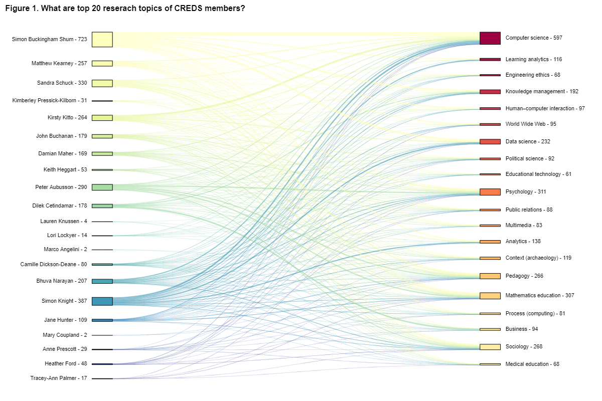
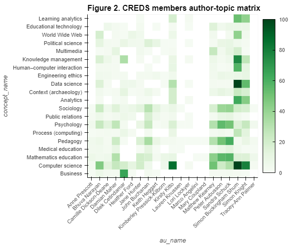
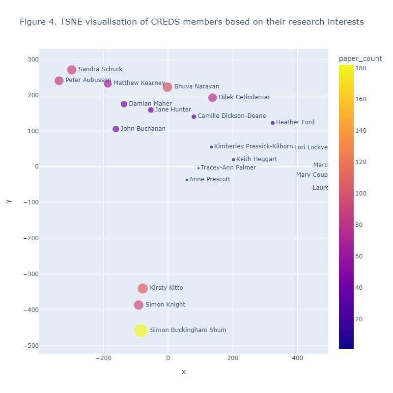

# Bibliometric project

## Before you run the project, please download the [data folder](https://drive.google.com/drive/folders/13cxpHmu1mJhVKTjkJDTHu05nxG0WbHnK?usp=sharing) and add it to the project root folder.

---

## Section A. Bibliometric insights from CREDS research outputs

- **A1. Basic data cleansing, author id and name disambiguation** 
    - remove noise
    - merge multiple ids
    - unify names
- **A2. CREDS members author-topic Sankey diagram**
    - visualise author-concept distributions
        
- **A3. CREDS members author-topic & correlation heatmaps** 
    - find who and who share similar research interests
        
        
- **A4. TSNE visualisation for CREDS members** 
    - show every CREDS member's position on a 2D plot (research interest based)
        
- **A5. CREDS research concept vector** 
    - A pooling vector representation of CREDS research direction
- **A6. Retrieve citation data for CREDS members** 
    - Data collection via API
    - for workflow purposes
    - generate 'data/ref_author.RDS' and 'data/ref_concept.RDS'
- **A7. How do CREDS members cite each other?** 
    - An internal citing map of CREDS members
- **A8. Who do CREDS members commonly cite the most?** 
    - The top commonly cited authors of CREDS members ([common_cited_authors.xlsx](https://github.com/DunnoHtL/CREDS_project/blob/master/output/commonly_cited_authors.xlsx))
- **A9. What concepts are cited most by CREDS members?** 
    - The top commonly cited concepts (topics) of CREDS members ([common_cited_topics.xlsx](https://github.com/DunnoHtL/CREDS_project/blob/master/output/commonly_cited_topics.xlsx))

## Section B. Construct Australian benchmarks for Education research

- **B1. Citation performance of CREDS members** 
    - CREDS members' citation performance
    - total citation per paper (pp.), yearly citation pp., and 3-year citation pp.  
    - Box plot of the three indicators
- **B2. Constructing a benchmark based on the concept *Education*** 
    - Education topic, and have AU authors.
    - Scalability issue here, the API only supports 10,000+ records per request.
    - We can use the year-separate approach for records < 10k per year
    - Or we can try to download the database snapshot at a bigger cost (https://docs.openalex.org/download-snapshot).
    - Perform analysis on the three citation indicators and compare.
- **B3. Constructing a benchmark based on the related works** 
    - Use the related works as a benchmark.
    - Perform analysis on the three citation indicators and compare.

## Section C. Zotero dataset analysis
- Get the data (article DOIs) via Zotero API (167 fetched)
- Citation map visualisation (154 connected papers)
- major path analysis (three important citing paths)